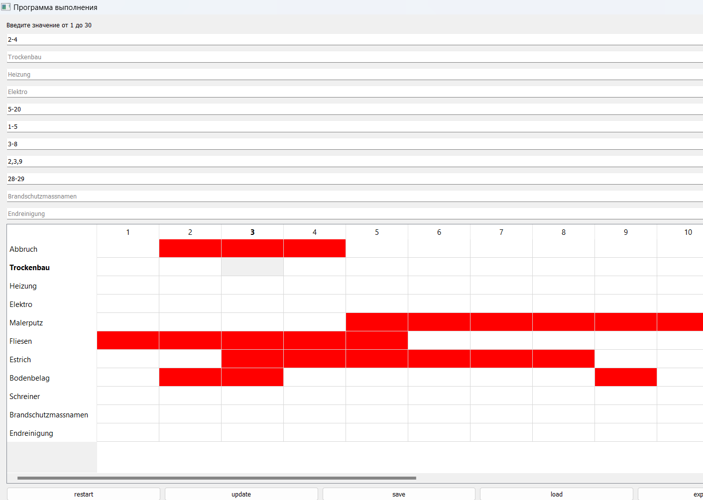

# Bauleitung Task Scheduler

###  Project Purpose

This project is a **learning tool** designed to assist in the creation of **construction supervision schedules** (German: *Bauleitung*), commonly used in architectural planning.  
It also serves as a basic visual aid for preparing task specifications required by **Bauherren** (clients or contractors).

---

###  What You Can Do

-  **Rename tasks** dynamically (e.g., Trockenbau, Elektro, etc.)
-  **Assign days** from **1 to 30** to each task:
  - Supported formats: comma-separated (`1,2,3`) or range (`10-15`)
-  **Highlight selected days** with color to indicate active work periods
-  Functional buttons:
  - `Restart` – reset all input
  - `Update` – refresh the table view
  - `Save / Load` – persist your data
  - `Export to Excel` – save the table to `.xlsx`
  - `Print` – print a table preview

---

###  Logic Summary

The application is built using **PyQt5**. It uses a `QTableWidget` to display tasks as rows and days (1–30) as columns.  
Each cell can be highlighted to represent working days.  
Users can:
- dynamically rename tasks,
- input day ranges per task,
- assign color markers,
- and export or print the full schedule.

---

###  Project Expansion

This is a minimal version of a scheduling tool.  
Planned improvements:
- support for subtasks,
- color categorization,
- collision/conflict detection,
- better UI/UX and automatic timeline generation.

---

###  Requirements

- Python 3.11+
- PyQt5
- pandas




Install dependencies:
```bash
pip install pyqt5 pandas

